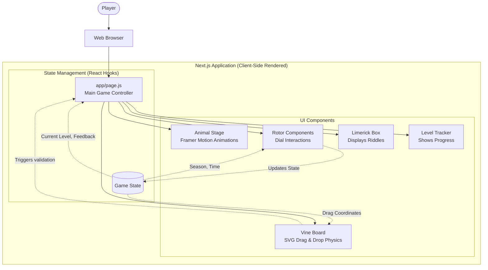

# 🦁 Cipher Safari: The Changing Skies

Welcome to **Cipher Safari: The Ultimate Kids' Enigma Cryptography Adventure**! 
Play it live here: 🎮 **[https://ciphersafari.vercel.app/](https://ciphersafari.vercel.app/)**

This interactive web game teaches players about encryption, logical deduction, and problem-solving through the lens of a beautiful, animated Safari adventure. It is inspired by the legendary **Enigma Machine**.

---

## 🔐 1. What is the Enigma Machine?

The Enigma machine was a famous cipher device used heavily during World War II to protect military communication. It looked a bit like an oversized typewriter, but it was incredibly complex for its time. When a letter was typed into the keyboard, it would pass through a series of rotating wheels (called "rotors") and a plugboard, scrambling the letter before lighting up the encrypted output on a lampboard.

Because the rotors moved after every single keypress, the encryption pathway constantly changed. Typing "A" three times in a row might output "P", then "X", then "L". It was considered mathematically unbreakable—until brilliant mathematicians and computer scientists like **Alan Turing** built machines to crack the code, changing the course of history!

---

## ⚙️ 2. How it Works

Imagine you and your best friend have a secret code ring. If you set your ring to "3", A becomes D, B becomes E, etc. That's a simple cipher. 

But what if your secret code ring *spins* slightly every time you write a letter? 

That is exactly what the Enigma machine did! It used a system of mechanical **Rotors** (spinning wheels with wires inside) and a **Plugboard** (cables that swapped specific letters, like A with Z). 

In our game, **Cipher Safari**:
- The **Season Rotor** and **Shadow Rotor** act like the spinning wheels of the Enigma machine. By changing them, you are altering the "encryption key".
- The **Vine Sockets** act like the Enigma's Plugboard. Connecting a colored vine to a specific socket completes the electrical circuit required to send the signal to the correct destination.

If you don't have the exact combination of Rotors and Plugboard connections, the signal gets scrambled and the cipher remains locked!

---

## 🎮 3. How to Play This Game

You are assisting Professor Alan Turing in deciphering the mysteries of the Safari! To unlock each animal habitat, you must configure your machine correctly based on the clues provided.

1. **Read the Scroll**: On the left side of the screen, you will see a poetic riddle. Look carefully for clues indicating a **Season**, a **Time of Day** (shadows), and a **Color/Location**.
2. **Set the Rotors**: Click and drag the **Season Rotor** (left dial) to match the season from the riddle. Then, set the **Shadow Rotor** (right dial) to the correct time of day.
3. **Connect the Plugboard (Vines)**: Grab a colored vine cord from the tree branch on the right. Drag and plug it into the correct tree stump socket indicated by the riddle.
4. **Unlock the Cipher**: If your dials and vine color match the secret combination perfectly, the encryption circuit will complete! The target animal will perform a happy dance, and you will unlock the next level!

---

## 🏗️ 4. Architecture Diagram

The game is built using a modern React/Next.js stack, leveraging Framer Motion for fluid animations and a custom coordinate-scaling architecture to support fully responsive game canvases.

### Tech Stack:
- **Framework**: [Next.js](https://nextjs.org/) (App Router)
- **Styling**: [Tailwind CSS](https://tailwindcss.com/)
- **Animations**: [Framer Motion](https://www.framer.com/motion/) for character movement and smooth transitions
- **Drag & Drop**: Native React pointer events mapped to SVG coordinate spaces
- **Deployment**: [Vercel](https://vercel.com/)
